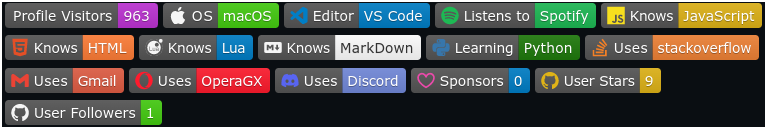

# ✨ Profile Customizer
Looking for a way to add cool badges, text &amp; images to your profile? If so read this repository!

## Profile Trophies

## Profile Badges
Profile Badges allow you to show people viewing your profile what programs you use, languages you know, profile views & more!

*Example of Profile Badges:*

### How Do I Use Profile Badges?
Profile Badges Can Be Customized With Custom Icons, Colors, & Text.

## Animated Text
Animated Text is a text typing animation that allows you to display text on your profile!

*Example of Animated Text:*

### How Do I Use Animated Text?
Animated Text can be used in both Markdown and HTML. You can use [this]([https://www.example.com](https://readme-typing-svg.herokuapp.com)) webiste to generate your own text including colors, speed & more!

## Profile Stats

## Media Buttons

## To Do
- [ ] Finish Profile Trophies
- [ ] Finish Profile Badges
- [ ] Finish Animated Text
- [ ] Finish Profile Stats
- [ ] Finish Media Buttons
- [ ] Add Files
- [ ] Add Screenshot Previews
